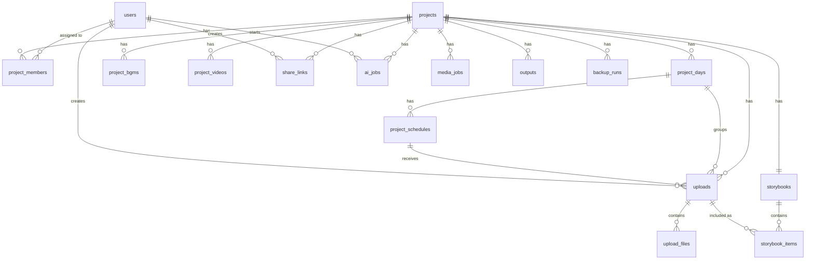

# MemoryFlow ERD Draft v2.0

Date: 2026-05-24  
Status: Development draft

## 1. Entity Overview



## 2. Core Tables

### users

Stores login accounts.

```sql
users (
  id uuid primary key,
  email text unique not null,
  password_hash text not null,
  name text not null,
  profile_image_path text,
  status text not null, -- pending, active, rejected, inactive
  global_role text, -- super_admin or null
  active_project_id uuid,
  last_login_at timestamptz,
  created_at timestamptz not null,
  updated_at timestamptz not null
)
```

### projects

Stores project-level metadata.

```sql
projects (
  id uuid primary key,
  name text not null,
  org_name text,
  description text,
  cover_image_path text,
  start_date date not null,
  end_date date not null,
  status text not null, -- active, completed, archived
  created_by uuid not null references users(id),
  created_at timestamptz not null,
  updated_at timestamptz not null
)
```

### project_members

Stores per-project roles.

```sql
project_members (
  id uuid primary key,
  project_id uuid not null references projects(id) on delete cascade,
  user_id uuid not null references users(id) on delete cascade,
  role text not null, -- project_manager, uploader
  status text not null, -- active, removed
  created_at timestamptz not null,
  updated_at timestamptz not null,
  unique (project_id, user_id)
)
```

### project_days

Auto-generated from project start/end dates.

```sql
project_days (
  id uuid primary key,
  project_id uuid not null references projects(id) on delete cascade,
  day_number integer not null,
  date date not null,
  title text,
  cover_image_path text,
  sort_order integer not null,
  created_at timestamptz not null,
  updated_at timestamptz not null,
  unique (project_id, day_number),
  unique (project_id, date)
)
```

### project_schedules

Stores schedule items under each day.

```sql
project_schedules (
  id uuid primary key,
  project_id uuid not null references projects(id) on delete cascade,
  day_id uuid not null references project_days(id) on delete cascade,
  time text,
  title text not null,
  location text,
  category text,
  sort_order integer not null,
  created_at timestamptz not null,
  updated_at timestamptz not null
)
```

## 3. Upload And Media Tables

### uploads

Stores upload records and notes.

```sql
uploads (
  id uuid primary key,
  project_id uuid not null references projects(id) on delete cascade,
  day_id uuid not null references project_days(id),
  schedule_id uuid not null references project_schedules(id),
  user_id uuid not null references users(id),
  type text not null, -- photo, video
  memo text,
  is_featured boolean not null default false,
  is_in_storybook boolean not null default true,
  admin_note text,
  sort_order integer not null default 0,
  created_at timestamptz not null,
  updated_at timestamptz not null,
  deleted_at timestamptz
)
```

### upload_files

Stores physical file metadata.

```sql
upload_files (
  id uuid primary key,
  upload_id uuid not null references uploads(id) on delete cascade,
  file_type text not null, -- image, video
  storage_path text not null,
  thumbnail_path text,
  preview_path text,
  cover_candidate_path text,
  original_name text not null,
  mime_type text not null,
  size_bytes bigint not null,
  width integer,
  height integer,
  duration_seconds numeric,
  sort_order integer not null default 0,
  created_at timestamptz not null
)
```

### media_jobs

Tracks local media processing.

```sql
media_jobs (
  id uuid primary key,
  project_id uuid not null references projects(id) on delete cascade,
  upload_file_id uuid references upload_files(id) on delete cascade,
  type text not null, -- thumbnail, preview, cover_candidate, video_frame
  status text not null, -- pending, processing, completed, failed
  error_message text,
  created_at timestamptz not null,
  started_at timestamptz,
  completed_at timestamptz
)
```

## 4. Storybook Tables

### storybooks

One storybook per project.

```sql
storybooks (
  id uuid primary key,
  project_id uuid unique not null references projects(id) on delete cascade,
  status text not null, -- draft, approved
  title text,
  opening_text text,
  closing_text text,
  approved_by uuid references users(id),
  approved_at timestamptz,
  unlocked_by uuid references users(id),
  unlocked_at timestamptz,
  created_at timestamptz not null,
  updated_at timestamptz not null
)
```

### storybook_items

Stores curated order and inclusion for uploads.

```sql
storybook_items (
  id uuid primary key,
  storybook_id uuid not null references storybooks(id) on delete cascade,
  upload_id uuid not null references uploads(id) on delete cascade,
  day_id uuid not null references project_days(id),
  schedule_id uuid not null references project_schedules(id),
  caption text,
  sort_order integer not null,
  is_visible boolean not null default true,
  created_at timestamptz not null,
  updated_at timestamptz not null,
  unique (storybook_id, upload_id)
)
```

## 5. BGM, Video, Outputs

### project_bgms

Stores manually uploaded BGM files.

```sql
project_bgms (
  id uuid primary key,
  project_id uuid not null references projects(id) on delete cascade,
  title text not null,
  storage_path text not null,
  source text not null, -- manual, generated
  is_active boolean not null default false,
  created_by uuid not null references users(id),
  created_at timestamptz not null,
  deleted_at timestamptz
)
```

### project_videos

Stores final videos uploaded by the super admin.

```sql
project_videos (
  id uuid primary key,
  project_id uuid not null references projects(id) on delete cascade,
  title text not null,
  storage_path text not null,
  thumbnail_path text,
  duration_seconds numeric,
  size_bytes bigint not null,
  status text not null, -- uploaded, published, hidden
  uploaded_by uuid not null references users(id),
  uploaded_at timestamptz not null,
  deleted_at timestamptz
)
```

### outputs

Stores generated outputs such as PDFs.

```sql
outputs (
  id uuid primary key,
  project_id uuid not null references projects(id) on delete cascade,
  type text not null, -- pdf
  title text not null,
  storage_path text not null,
  cover_image_path text,
  generated_by uuid not null references users(id),
  created_at timestamptz not null,
  deleted_at timestamptz
)
```

## 6. Sharing And AI

### share_links

Stores hashed public share links.

```sql
share_links (
  id uuid primary key,
  token_hash text unique not null,
  project_id uuid not null references projects(id) on delete cascade,
  type text not null, -- storybook, video, both
  is_active boolean not null default true,
  expires_at timestamptz not null,
  created_by uuid not null references users(id),
  created_at timestamptz not null,
  disabled_at timestamptz
)
```

### ai_jobs

Tracks Codex CLI jobs.

```sql
ai_jobs (
  id uuid primary key,
  project_id uuid not null references projects(id) on delete cascade,
  storybook_id uuid references storybooks(id) on delete set null,
  requested_by uuid not null references users(id),
  type text not null,
  status text not null, -- pending, processing, completed, failed, canceled
  input_json jsonb not null,
  result_json jsonb,
  model text,
  error_message text,
  created_at timestamptz not null,
  started_at timestamptz,
  completed_at timestamptz
)
```

Recommended `ai_jobs.type` values:

```text
storybook_review
memo_summary
caption_timeline
bgm_keywords
project_cover_image
day_cover_image
video_cover_image
pdf_cover_image
```

## 7. Backup

### backup_runs

Tracks project-level backups.

```sql
backup_runs (
  id uuid primary key,
  project_id uuid not null references projects(id) on delete cascade,
  backup_type text not null, -- daily, weekly, snapshot
  status text not null, -- pending, processing, completed, failed
  db_dump_path text,
  files_archive_path text,
  manifest_path text,
  error_message text,
  created_at timestamptz not null,
  completed_at timestamptz
)
```

## 8. Important Indexes

```sql
create index idx_project_members_user on project_members(user_id);
create index idx_project_members_project on project_members(project_id);
create index idx_project_days_project on project_days(project_id, sort_order);
create index idx_project_schedules_day on project_schedules(day_id, sort_order);
create index idx_uploads_project on uploads(project_id, created_at desc);
create index idx_uploads_user on uploads(user_id, created_at desc);
create index idx_uploads_schedule on uploads(schedule_id, sort_order);
create index idx_upload_files_upload on upload_files(upload_id, sort_order);
create index idx_storybook_items_storybook on storybook_items(storybook_id, sort_order);
create index idx_share_links_token_hash on share_links(token_hash);
create index idx_ai_jobs_status on ai_jobs(status, created_at);
create index idx_media_jobs_status on media_jobs(status, created_at);
create index idx_backup_runs_project on backup_runs(project_id, created_at desc);
```

## 9. Key Rules

```text
Only super_admin can create/delete projects.
Only super_admin can approve users.
Only super_admin can generate PDF, AI images, BGM, VideoFlow package, and final video uploads.
Project managers can edit and approve storybooks for assigned projects.
Project managers can run text AI review only.
Uploaders can edit own uploads only before storybook approval.
External viewers can only access data through valid share links.
```
